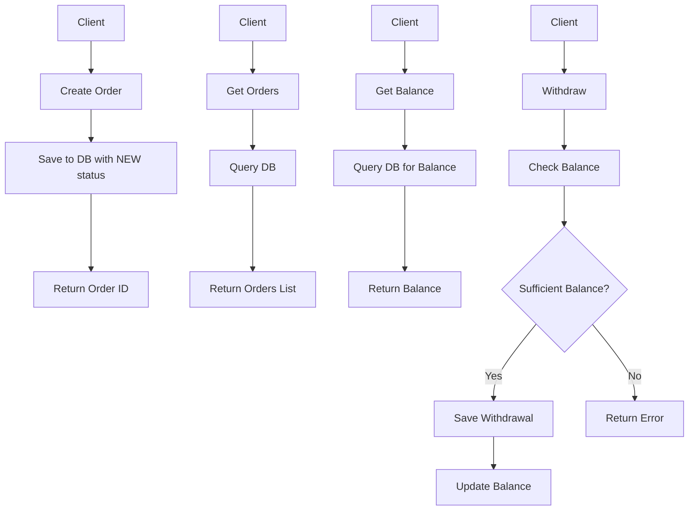
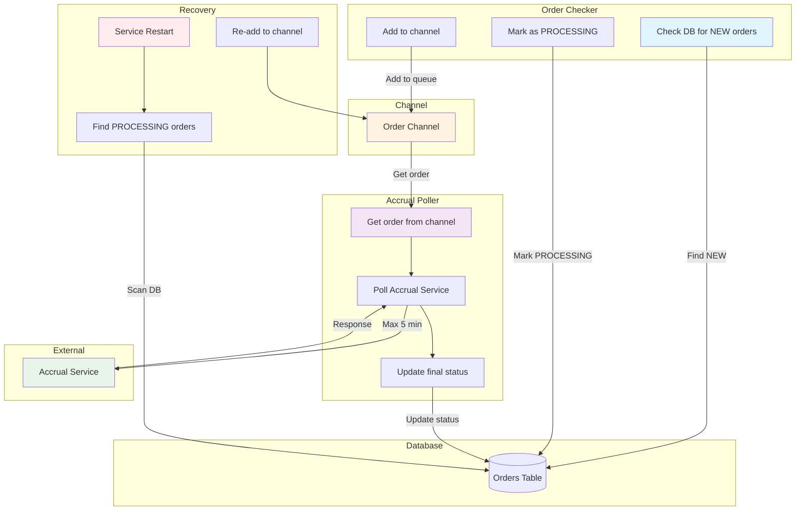

# Order Flow Diagrams

## Current Order Processing Flow

## Order Processing with Goroutine Pools

## Key Features

1. **Order Checker**:
    - Checks DB for `NEW` orders
    - Marks them as `PROCESSING`
    - Adds to channel queue

2. **Accrual Poller**:
    - Takes orders from channel
    - Polls accrual service (max 5 min)
    - Updates final status

3. **Recovery**:
    - On restart, finds `PROCESSING` orders
    - Re-adds them to channel
